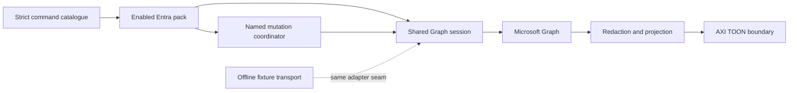

# mg-axi implementation plan

Approved planning baseline: 2026-10-03.
See [README.md](README.md) for the current package, installation and CLI behavior.

## Outcome and scope

Build an agent-facing Microsoft Graph CLI with one shared Graph core and domain packs.
Deliver the full Entra map first, with SOC-critical reads before the long tail.
Preserve az-axi's familiar noun/subnoun/verb grammar and deliberate write gates while using Graph's actual identity, API, paging and permission contracts.

The initial surface is `mg-axi entra …` plus a reviewed read-only `mg-axi api` escape hatch.
Future named Security, Intune and Microsoft 365 packs require separate authorization.
Permissions are requested per enabled pack and operation.
Sensitive mail/files access stays disabled unless explicitly enabled.
Raw reachability does not count as a named Entra command.

Success has two milestones: a useful SOC read release and complete coverage of the agreed Entra inventory, including later named writes.
A complete inventory must distinguish named commands, reviewed raw reads, scheduled work, intentionally blocked operations, deprecated operations and version/cloud unavailability.
Scheduled work cannot be counted as finished.
The representative tables in this plan are research inputs, not a claim of an already enumerated full map.

- [Dispatch-ready slices](docs/build-plan.md) define IDs, dependencies and acceptance.
- [Graph coverage and access](docs/graph-coverage.md) records operations, permissions, licence distinctions and the full-map inventory gate.
- [Execution contract](docs/execution.md) defines reads, write gates and initial mutations.
- [Design evidence](docs/design-evidence.md) grounds az-axi comparisons in a pinned source revision.

## Approved choices

| Choice | Decision and reason | Consequence of the alternative |
|---|---|---|
| Shared code | One shared Graph core inside mg-axi, reuse the existing AXI SDK, adapt only needed attributed az-axi helpers. Defer extracting a new package shared with az-axi until common callers prove its depth. | Immediate extraction couples releases and may expose ARM/Graph policy differences through a shallow callback-heavy interface. |
| Authentication | Dedicated organization-owned app registration; browser delegated bootstrap for analysts, certificate or workload federation for application automation. Both modes are in the initial foundation. | Azure CLI token reuse has an existing-consent ceiling; device code depends on organization policy. Neither substitutes for first-class app-only support. |
| API version | v1.0 default, isolated explicitly enabled beta reads. No automatic fallback. | Stable-only would omit beta-only Entra areas until promotion; treating beta as ordinary stable behavior weakens compatibility. |
| Initial environment | Commercial workforce tenants first. | Sovereign and external-customer environments require their own authority, host, operation and licensing contracts before support is claimed. |

Worked example: a paging correction lands once in the shared Graph session and benefits every pack.
An ARM subscription allowlist is not copied into Entra; the new write boundary uses the configured tenant and named operation.
A beta-only network-access read requires both a preview-enabled profile and explicit `--api-version beta`, and cannot mutate.
An app-only scheduled inventory job never invokes a browser or falls back to an analyst identity.

## Architecture and module depth



The catalogue is the source of truth for command grammar, flags, effects, operation IDs/versions, supported auth modes/query options, compact fields, permission/role/licence source references and coverage status.
Help, generated skill, setup guidance and capability reporting consume it.
Operation-specific request construction stays beside its command; do not invent a generic endpoint DSL to express arbitrary behavior.

The shared Graph session accepts an operation and typed context.
It hides profile resolution, authentication, immutable tenant/cloud identity, policy, safe paths/URLs, redirects, paging, retries, cancellation and error translation.
Callers cannot supply arbitrary bearer headers or bypass the session with fetch.
Deleting this module would spread security and HTTP complexity across every command, so it earns its depth.
A pass-through service per endpoint would not.

The mutation coordinator owns the sequence that must never vary: immutable scope, enablement, preview, execute gates, current-state reread, confirmation, audit-before-send, request and outcome.
Endpoint-specific concurrency and action semantics remain in each mutation contract.
It shares transport with reads while keeping mutation policy explicit.

Output keeps internal structured values, redacts protected material, applies projection and serializes TOON once.
Null, inaccessible, absent and empty are different outcomes.
Redaction applies to successful output, errors, previews, logs and audit payloads.

Start with a static Entra pack registration table.
Do not add a plugin loader before a second pack needs one.
Real HTTP, credential providers, clock and filesystem persistence are meaningful external seams.
Avoid extra layers that merely forward an SDK call.

## AXI behavior and command grammar

```text
mg-axi
mg-axi entra user list --profile soc --limit 100
mg-axi entra user show --id <user-id-or-upn>
mg-axi entra group member list --group <group-object-id>
mg-axi entra conditional-access policy list
mg-axi entra conditional-access named-location list
mg-axi entra user authentication-method list --user <user-id>
mg-axi entra sign-in list --since <ISO-time>
mg-axi entra risky-user list
mg-axi entra application show --id <object-id>
mg-axi api GET /users --profile soc
```

These are target contracts; [README.md](README.md) describes the current CLI surface.
The inventory and strict leaf schema define every supported command before publication.

| AXI principle | Contract |
|---|---|
| Content-first home | Show selected profile/tenant, available domains and bounded useful summaries; denied or unavailable sections are not zeros. |
| Compact output | Default lists expose 3-4 useful fields and truthful returned/completion information; TOON is the structured boundary. |
| Progressive disclosure | Per-leaf help, examples and recovery instructions; `--full` removes text truncation but never redaction or row caps. |
| Strict input | Unknown flags, typos and unsupported combinations fail before credentials or HTTP with exit 2. |
| Scriptable behavior | Ordinary commands never prompt; explicit login and execute confirmation are separate flows. Data/errors use stdout, progress stderr. Operational failure exits 1; success and no-op exit 0. |
| Sustainable documentation | Generate help, skill and capability metadata from the same catalogue; fast version does not load the command graph; hooks install only explicitly. |

Use az-like group/subgroup/verb grammar, `list` for collections and `show` for one object.
`--id` identifies a Graph object unless the command explicitly supports another identifier.
Never silently conflate object ID with application/client ID.
`--filter` is OData, `--select` requests server properties, and `--fields` projects locally.
Reserve `--query` for az-compatible output-query semantics rather than assigning it an unrelated meaning.
`--limit` caps output and `--all` follows pages within an explicit budget.
Unsupported advanced-query combinations fail early instead of forwarding a misleading request.

## Authentication, app registration and profiles

Use Microsoft's authentication libraries with Graph HTTP rather than a PowerShell subprocess backend.
The dedicated app registration defines client identity and consent.
Delegated browser sign-in is the analyst default.
Device code is an optional alternative, off by default, explicitly selected when a local browser callback is impractical and only if organization policy permits it; it is never an automatic fallback.
Both remain delegated access and require the client's appropriate delegated consent plus the signed-in user's required role.
Application access uses client credentials with certificate or workload federation, admin-consented application permissions and no user context.
See [authentication providers](https://learn.microsoft.com/en-us/graph/sdks/choose-authentication-providers), [delegated access](https://learn.microsoft.com/en-us/graph/auth-v2-user), [application access](https://learn.microsoft.com/en-us/graph/auth-v2-service), and [device code](https://learn.microsoft.com/en-us/entra/identity-platform/v2-oauth2-device-code).

Profile schema must discriminate delegated from application mode so impossible combinations cannot be stored.
Profiles include explicit tenant ID, client ID, cloud, enabled packs, preview/sensitive-area policy and references to credential providers.
Secrets, tokens and private keys never enter argv, profile JSON or output.
Use OS-protected persistence where supported, otherwise session-only credential storage.
Application profiles support certificate and workload federation providers; they cannot invoke interactive login or delegated fallback.
Versioned config changes must migrate explicitly or fail with actionable guidance rather than silently changing identity.

Application token requests use the configured Graph audience with `https://graph.microsoft.com/.default` for the initial commercial cloud.
This is the app's consented application grants, not a per-command dynamic subset.
Pack-based least privilege therefore applies to registration/consent and local operation gating.
A broad token cannot be narrowed by hiding a command; separate app registrations/profiles provide stronger domain isolation.
Do not demand blanket Directory.ReadWrite.All to simplify setup.
Sources: [client credentials](https://learn.microsoft.com/en-us/entra/identity-platform/v2-oauth2-client-creds-grant-flow), [permission types](https://learn.microsoft.com/en-us/graph/permissions-overview).

Treat Graph access tokens as opaque.
Obtain identity from configured auth-library account context and reliable server evidence, not JWT decoding assumptions.
Represent delegated/application support independently per operation; app-only cannot use `/me`.
An explicit external-token bridge, if later added, remains read-only until reliable binding exists.
It is not a dependency of the approved native auth foundation.

Worked example: an app-only profile with `Policy.Read.All` may list CA policies without a user.
A delegated profile still requires a supported user role and client consent.
A missing grant produces an actionable operation-specific error, not an automatic consent change or a switch to another identity.
A 403 alone cannot establish whether the missing prerequisite is permission, role, licence or policy.

## Read and write safety

Follow exact Graph `@odata.nextLink` values with required headers and revalidate origin/version before attaching credentials.
A row cap cannot discard the remainder of an already fetched page.
Preserve buffered rows/query context when a continuation is exposed.
Use bounded safe-read retries, Retry-After, cancellation and truthful partial-result information.
See [paging](https://learn.microsoft.com/en-us/graph/paging), [throttling](https://learn.microsoft.com/en-us/graph/throttling) and the detailed [execution contract](docs/execution.md).

Reads remain the default even after named writes ship.
Writes require a manually enabled profile, immutable configured tenant/operation allowlist, preview, explicit `--execute`, target confirmation and durable audit intent before sending.
A forced read-only environment override always wins.
CLI read overrides cannot broaden write scope.
Graph has no universal dry-run, what-if, ETag or rollback; each operation declares what it can actually prove.
Unknown outcomes never trigger blind mutation retries.

The first later writes are user membership addition, account enabled state, session revocation, CA policy update and risky-user dismissal.
Additional agreed Entra mutations come from the full inventory, each with an operation-specific contract.
Read success does not qualify a corresponding write.
Raw API writes, unreviewed actions, secret-returning operations and beta writes remain blocked.

## Maintainability and extension procedure

1. Select exact rows from the [pinned discovery inventory](docs/inventory.md) and record reviewed version, auth-mode, access/licence/cloud constraints and sources in the implementation catalogue.
2. Add a strict command declaration and local operation mapping in the Entra pack.
3. Use the shared Graph session and existing output boundary; add a mutation contract only for a separately reviewed named write.
4. Add fixture evidence through the lowest real interface observing behavior, including realistic denial/partial results.
5. Regenerate help, setup permission guidance, installable skill and coverage reports from the catalogue.
6. Review the changed capability inventory alongside the implementation.

An upstream metadata refresh produces a reviewed diff.
It never enables new commands, requests extra consent or marks new operations writable automatically.
Record source dates and update changed operation contracts deliberately.
An abstraction is accepted only when it hides complexity from real callers; code sharing alone is not sufficient.
Cross-repository extraction can be revisited when identical behavior and tests in az-axi and mg-axi justify one stable interface.

## Offline verification

No test, setup check or docs review in this work may authenticate to or call a real tenant.
Use synthetic fixture HTTP and credentials at real boundaries.
Reuse the repository's fixtures/builders and test conventions as they are established.

Test the Graph session's observable paging, retry, policy and error behavior through its public interface.
Test domain mapping/query behavior at the command interface.
Reserve packaged CLI E2E for critical journeys lower levels miss, with temporary home/config, closed stdin, clean environment and blocked outbound networking.
Include both authentication modes in the critical read and future write paths.

Verify successful, empty, denied, partial, throttled and unsupported results.
Include wrong tenant, hostile redirects/continuations, encoded paths, unknown fields/enums, hidden memberships, app versus object IDs, active versus eligible PIM and redaction sentinels.
Writes additionally prove zero sends on gate failure, audit failure ordering, no-op/preview, conflict and uncertain outcome.
Mock only true external seams and use fake time for retry/expiry.
One behavior per deterministic test; no sleeps, live LLM tests, implementation-text assertions or numerical coverage target.
Capability coverage is an inventory requirement, separate from test coverage.

Offline checks prove the client contract, not a tenant's actual consent, role, licensing or availability.
Do not use real-tenant validation to close that distinction.

## Risks and release gates

The [discovery inventory](docs/inventory.md) defines the operation-level boundary; reviewed access and implementation coverage remain later-slice gates.
Graph and licensing documentation can change; verify every added operation against its current primary source.
Read permissions can still expose personal or sensitive information.
Local pack policy does not revoke broad app consent.
Preview cannot eliminate concurrency races where the endpoint supplies no reliable precondition.
Beta contracts can change and stay isolated.
A full-Entra completion claim must account for every agreed operation without hiding scheduled work under raw API access.
Separate product authorization is required if a discovered boundary materially changes the approved scope.
